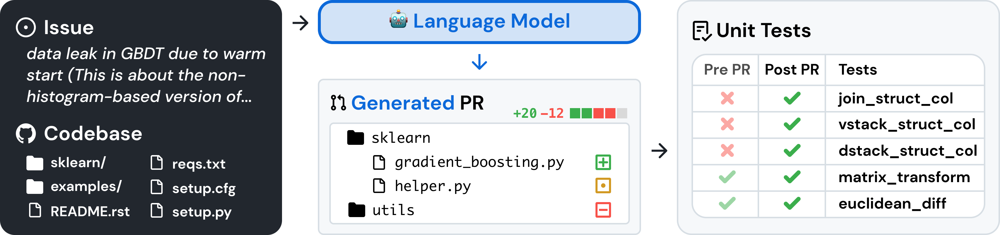

> **Dataset & logs:** This replication is large—the **full project** (all experimental **data** and **logs**) totals about **11 GB**, so those artifacts are intentionally omitted from the Git-tracked tree. The **complete package has been uploaded in split volumes to GitHub Releases**; please retrieve it from the **Releases** page.

<p align="center">
  <a href="http://swe-bench.github.io">
    
  </a>
</p>

<p align="center"><strong>[&nbsp;<a href="https://swebench.com/SWE-bench/">Read the Docs</a>&nbsp;]</strong></p>

<p align="center">
  <a href="docs/other_languages/README_JP.md">日本語</a> |
  <a href="docs/other_languages/README_CN.md">中文简体</a> |
  <a href="docs/other_languages/README_TW.md">中文繁體</a>
</p>

<p align="center">
    <a href="https://www.python.org/">
        
    </a>
    <a href="https://copyright.princeton.edu/policy">
        
    </a>
    <a href="https://badge.fury.io/py/swebench">
        
    </a>
</p>

---

Code and data for the following works:
* [ICLR 2025] <a href="https://arxiv.org/abs/2410.03859">SWE-bench Multimodal: Do AI Systems Generalize to Visual Software Domains?</a>
* [ICLR 2024 Oral] <a href="https://arxiv.org/abs/2310.06770">SWE-bench: Can Language Models Resolve Real-World GitHub Issues?</a>

## 📰 News
* **[Jan. 13, 2025]**: We've integrated [SWE-bench Multimodal](https://swebench.com/multimodal) ([paper](https://arxiv.org/abs/2410.03859), [dataset](https://huggingface.co/datasets/SWE-bench/SWE-bench_Multimodal)) into this repository! Unlike SWE-bench, we've kept evaluation for the test split *private*. Submit to the leaderboard using [sb-cli](https://github.com/swe-bench/sb-cli/tree/main), our new cloud-based evaluation tool.
* **[Jan. 11, 2025]**: Thanks to [Modal](https://modal.com/), you can now run evaluations entirely on the cloud! See [here](https://github.com/swe-bench/SWE-bench/blob/main/docs/assets/evaluation.md#%EF%B8%8F-evaluation-with-modal) for more details.
* **[Aug. 13, 2024]**: Introducing *SWE-bench Verified*! Part 2 of our collaboration with [OpenAI Preparedness](https://openai.com/preparedness/). A subset of 500 problems that real software engineers have confirmed are solvable. Check out more in the [report](https://openai.com/index/introducing-swe-bench-verified/)!
* **[Jun. 27, 2024]**: We have an exciting update for SWE-bench - with support from [OpenAI's Preparedness](https://openai.com/preparedness/) team: We're moving to a fully containerized evaluation harness using Docker for more reproducible evaluations! Read more in our [report](https://github.com/swe-bench/SWE-bench/blob/main/docs/20240627_docker/README.md).
* **[Apr. 2, 2024]**: We have released [SWE-agent](https://github.com/SWE-agent/SWE-agent), which sets the state-of-the-art on the full SWE-bench test set! ([Tweet 🔗](https://twitter.com/jyangballin/status/1775114444370051582))
* **[Jan. 16, 2024]**: SWE-bench has been accepted to ICLR 2024 as an oral presentation! ([OpenReview 🔗](https://openreview.net/forum?id=VTF8yNQM66))

## 👋 Overview
SWE-bench is a benchmark for evaluating large language models on real world software issues collected from GitHub.
Given a *codebase* and an *issue*, a language model is tasked with generating a *patch* that resolves the described problem.



To access SWE-bench, copy and run the following code:
```python
from datasets import load_dataset
swebench = load_dataset('princeton-nlp/SWE-bench', split='test')
```

## 🚀 Set Up
SWE-bench uses Docker for reproducible evaluations.
Follow the instructions in the [Docker setup guide](https://docs.docker.com/engine/install/) to install Docker on your machine.
If you're setting up on Linux, we recommend seeing the [post-installation steps](https://docs.docker.com/engine/install/linux-postinstall/) as well.

Finally, to build SWE-bench from source, follow these steps:
```bash
git clone git@github.com:princeton-nlp/SWE-bench.git
cd SWE-bench
pip install -e .
```

Test your installation by running:
```bash
python -m swebench.harness.run_evaluation \
    --predictions_path gold \
    --max_workers 1 \
    --instance_ids sympy__sympy-20590 \
    --run_id validate-gold
```
> [!NOTE]
> If using a MacOS M-series or other ARM-based systems, add `--namespace ''` to the above script.
> By default, the evaluation script pulls images (built for Linux) from [DockerHub](https://hub.docker.com/u/swebench).
> Adding `--namespace ''` will cause evaluation images to be built locally instead.

## 💽 Usage
Evaluate patch predictions on SWE-bench Lite with the following command:
```bash
python -m swebench.harness.run_evaluation \
    --dataset_name princeton-nlp/SWE-bench_Lite \
    --predictions_path <path_to_predictions> \
    --max_workers <num_workers> \
    --run_id <run_id>
    # use --predictions_path 'gold' to verify the gold patches
    # use --run_id to name the evaluation run
    # use --modal true to run on Modal
```

This command will generate docker build logs (`logs/build_images`) and evaluation logs (`logs/run_evaluation`) in the current directory.

The final evaluation results will be stored in the `evaluation_results` directory.

> [!WARNING]
> SWE-bench evaluation can be resource intensive
> We recommend running on an `x86_64` machine with at least 120GB of free storage, 16GB of RAM, and 8 CPU cores.
> We recommend using fewer than `min(0.75 * os.cpu_count(), 24)` for `--max_workers`.
>
> If running with Docker desktop, make sure to increase your virtual disk space to ~120 free GB. Set max_workers to be consistent with the above for the CPUs available to Docker.
>
> Support for `arm64` machines is experimental.

To see the full list of arguments for the evaluation harness, run:
```bash
python -m swebench.harness.run_evaluation --help
```

See the [evaluation tutorial](docs/guides/evaluation.md) for the full rundown on datasets you can evaluate.
If you're looking for non-local, cloud based evaluations, check out...
* [sb-cli](https://github.com/swe-bench/sb-cli), our tool for running evaluations automatically on AWS, or...
* Running SWE-bench evaluation on [Modal](https://modal.com/). Details [here](docs/guides/evaluation.md#Cloud-Based-Evaluation)

Additionally, you can also:
* [Train](https://github.com/swe-bench/SWE-bench/tree/main/swebench/inference/make_datasets) your own models on our pre-processed datasets. (🆕 Check out [SWE-smith](https://swesmith.com/), a dedicated toolkit for creating SWE training data.)
* Run [inference](docs/reference/inference.md) on existing models (both local and API models). The inference step is where you give the model a repo + issue and have it generate a fix.
*  Run SWE-bench's [data collection procedure](https://github.com/swe-bench/SWE-bench/blob/main/swebench/collect/) ([tutorial](docs/guides/collection.md)) on your own repositories, to make new SWE-Bench tasks.
    * ⚠️ We are temporarily pausing support for queries around creating SWE-bench instances. Please see the note in the tutorial.

## ⬇️ Downloads
| Datasets | Models | RAG |
| - | - | - |
| [💿 SWE-bench](https://huggingface.co/datasets/SWE-bench/SWE-bench) | [🦙 SWE-Llama 13b](https://huggingface.co/princeton-nlp/SWE-Llama-13b) | [🤗 "Oracle" Retrieval](https://huggingface.co/datasets/princeton-nlp/SWE-bench_oracle) |
| [💿 SWE-bench Lite](https://huggingface.co/datasets/SWE-bench/SWE-bench_Lite) | [🦙 SWE-Llama 13b (PEFT)](https://huggingface.co/princeton-nlp/SWE-Llama-13b-peft) | [🤗 BM25 Retrieval 13K](https://huggingface.co/datasets/princeton-nlp/SWE-bench_bm25_13K) |
| [💿 SWE-bench Verified](https://huggingface.co/datasets/SWE-bench/SWE-bench_Verified) | [🦙 SWE-Llama 7b](https://huggingface.co/princeton-nlp/SWE-Llama-7b) | [🤗 BM25 Retrieval 27K](https://huggingface.co/datasets/princeton-nlp/SWE-bench_bm25_27K) |
| [💿 SWE-bench Multimodal](https://huggingface.co/datasets/SWE-bench/SWE-bench_Multimodal) | [🦙 SWE-Llama 7b (PEFT)](https://huggingface.co/princeton-nlp/SWE-Llama-7b-peft) | [🤗 BM25 Retrieval 40K](https://huggingface.co/datasets/princeton-nlp/SWE-bench_bm25_40K) |
| | | [🤗 BM25 Retrieval 50K (Llama tokens)](https://huggingface.co/datasets/princeton-nlp/SWE-bench_bm25_50k_llama) |

## 💫 Contributions
We would love to hear from the broader NLP, Machine Learning, and Software Engineering research communities, and we welcome any contributions, pull requests, or issues!
To do so, please either file a new pull request or issue and fill in the corresponding templates accordingly. We'll be sure to follow up shortly!

Contact person: [Carlos E. Jimenez](http://www.carlosejimenez.com/) and [John Yang](https://john-b-yang.github.io/) (Email: carlosej@princeton.edu, johnby@stanford.edu).

## ✍️ Citation & license
MIT license. Check `LICENSE.md`.

If you find our work helpful, please use the following citations.

For SWE-bench (Verified):
```bibtex
@inproceedings{
    jimenez2024swebench,
    title={{SWE}-bench: Can Language Models Resolve Real-world Github Issues?},
    author={Carlos E Jimenez and John Yang and Alexander Wettig and Shunyu Yao and Kexin Pei and Ofir Press and Karthik R Narasimhan},
    booktitle={The Twelfth International Conference on Learning Representations},
    year={2024},
    url={https://openreview.net/forum?id=VTF8yNQM66}
}
```

For SWE-bench Multimodal
```bibtex
@inproceedings{
    yang2024swebenchmultimodal,
    title={{SWE}-bench Multimodal: Do AI Systems Generalize to Visual Software Domains?},
    author={John Yang and Carlos E. Jimenez and Alex L. Zhang and Kilian Lieret and Joyce Yang and Xindi Wu and Ori Press and Niklas Muennighoff and Gabriel Synnaeve and Karthik R. Narasimhan and Diyi Yang and Sida I. Wang and Ofir Press},
    booktitle={The Thirteenth International Conference on Learning Representations},
    year={2025},
    url={https://openreview.net/forum?id=riTiq3i21b}
}
```

For SWE-bench Multilingual
```bibtex
@misc{yang2025swesmith,
    title={SWE-smith: Scaling Data for Software Engineering Agents},
    author={John Yang and Kilian Lieret and Carlos E. Jimenez and Alexander Wettig and Kabir Khandpur and Yanzhe Zhang and Binyuan Hui and Ofir Press and Ludwig Schmidt and Diyi Yang},
    year={2025},
    eprint={2504.21798},
    archivePrefix={arXiv},
    primaryClass={cs.SE},
    url={https://arxiv.org/abs/2504.21798},
}
```

## Our Other Projects

<div align="center">
  <a href="https://github.com/SWE-bench/sb-cli"></a>
   &nbsp;&nbsp;
  <a href="https://github.com/SWE-bench/SWE-smith"></a>
   &nbsp;&nbsp;
  <a href="https://github.com/SWE-agent/SWE-agent"></a>
   &nbsp;&nbsp;
  <a href="https://github.com/codeclash-ai/codeclash"></a>
  &nbsp;&nbsp;
  <a href="https://github.com/SWE-agent/Mini-SWE-Agent"></a>
  &nbsp;&nbsp;
  <a href="https://github.com/SWE-agent/SWE-ReX"></a>
</div>

## Experiment Workflow Used in This Project

**Environment and prerequisites**

Before reproducing the pipelines below, install and configure the following on your machine (take only what each experiment group needs):

1. **WSL 2 and an Ubuntu distribution**: Often used for Modal evaluation and for running the harness on Linux; if native Windows Python lacks the `resource` module, run those commands inside WSL instead.
2. **Docker (Docker Desktop or Docker Engine)**: Required for the local SWE-bench Docker harness, `docker build` / `docker run`, image cache, and evaluation containers.
3. **Python virtual environments**: Create `venv` / `.venv-modal`, etc. on Windows or WSL, run `pip install -e .` for this repo, and add any extra dependencies each script needs.
4. **sb-cli**: The official SWE-bench cloud evaluation CLI; install it and complete account setup before submit/fetch.
5. **Modal**: Optional cloud path; typically install `modal` and `swebench[modal]` in a WSL venv and run `modal setup` to log in.
6. **Ollama**: Local inference server for large models; hosts **olmo-3 (~7B)** and similar; listen address/port depend on your install (experiments can point via env vars).
7. **olmo-3 (~7B)**: Pull an olmo-3 variant in Ollama (e.g. `olmo-3:latest`; exact tag follows Ollama/library naming). Ensure disk and VRAM/RAM meet inference needs.
8. **Cloud model APIs (as needed)**: For Kimi K2.5, GPT-5.4, Sonnet 4.6 patch generation or evaluation, you need the corresponding API keys, billing, and network access.

Also install **Git**, use a Python version that satisfies this repo, and reserve **enough disk** for Docker images and directories such as `logs/` and `eval_logs/`.

> **Public repository note:** Unless an absolute path is written explicitly, paths below are relative to the repository root. Do not put API keys, tokens, or personal proxy endpoints in public docs or commit them to Git.

The workflow is as follows. PowerShell examples assume the current directory is already the repo root; under WSL, `cd` to the same clone (mount path varies by machine), then run the bash examples.

There are five experiment groups: first local large-model run, second local large-model run, Kimi K2.5 cloud API, GPT-5.4 cloud API, and Sonnet 4.6 cloud API. Each group has two phases: **patch generation** and **patch evaluation**.

**1. First local large-model experiment: olmo-3 10-instance batch**

The first local experiment is not limited to `astropy__astropy-14309`. It uses `run_olmo3_batch10.py` for batch patch generation and local Docker evaluation on these 10 instances:

astropy__astropy-14309  
astropy__astropy-14995  
astropy__astropy-7166  
astropy__astropy-7336  
django__django-10097  
django__django-10880  
django__django-10914  
django__django-10999  
django__django-11066  
pytest-dev__pytest-10051  

This phase uses local Ollama `olmo-3:latest` to generate patches and the SWE-bench Docker harness for local evaluation. Official batch script:

```powershell
python .\run_olmo3_batch10.py
```

What the script does:

1. Loads the 10 instances from the `test` split of `princeton-nlp/SWE-bench`.
2. Builds a prompt per instance and calls the local Ollama API to produce a `git diff` patch.
3. Extracts `diff --git` from model output, normalizes line endings, and checks `---`, `+++`, `@@`, etc.
4. Runs `git apply --check` against each repo’s `base_commit`.
5. Writes `prompt.txt`, `ollama_raw_attempt_*.txt`, `attempts.json`, `model_patch_preview.diff`, `predictions.json`, and `run_summary.json` per instance.
6. After all 10 pass precheck, merges into `predictions_all.json` and runs one unified local Docker SWE-bench evaluation.

If Ollama is not on the default URL, set in PowerShell:

```powershell
$env:OLLAMA_URL = "http://127.0.0.1:<OLLAMA_PORT>/api/generate"
python .\run_olmo3_batch10.py
```

(Replace `<OLLAMA_PORT>` with your listen port; `11434` is common locally.)

Main outputs: `olmo3/batch_precheck_*`, `olmo3/batch_precheck_*/predictions_all.json`, `olmo3/batch_precheck_*/batch_summary.json`, `olmo3/batch_precheck_*/evaluation_all.log`, `olmo3/batch_precheck_*/evaluation_report.json`.

`run_local_verified_olmo3.py` is an older single-instance end-to-end check for local `olmo-3:latest`, Ollama, and Docker. The formal first local 10-instance run is `run_olmo3_batch10.py`.

**Report file locations (relative to repo root):** Aggregates in `olmo3/batch_precheck_*/evaluation_report.json`, `olmo3/batch_precheck_*/batch_summary.json`, `olmo3/batch_precheck_*/evaluation_all.log`; merged predictions in `olmo3/batch_precheck_*/predictions_all.json`. If the harness also writes under the repo root, check `logs/run_evaluation/` and `logs/build_images/` (exact layout depends on `run_id` and script settings).

**2. Second local large-model experiment: olmo-3 Astropy 10 instances**

The second local batch uses these Astropy instances:

astropy__astropy-12907  
astropy__astropy-13033  
astropy__astropy-13236  
astropy__astropy-13453  
astropy__astropy-13977  
astropy__astropy-14096  
astropy__astropy-14182  
astropy__astropy-14365  
astropy__astropy-14508  
astropy__astropy-14539  

This is **not** the `run_olmo3_batch10.py` instance set; it is the Astropy-only second selection. Related paths: `olom-3-v2/astropy10_second_instance_selection/`.

Generate raw model output:

```powershell
python .\run_olmo3_astropy10_fixed_logs.py
```

Resume from interruption:

```powershell
python .\continue_astropy10_batch.py
```

These call local `olmo-3:latest`, read each instance’s issue text, build prompts, ask for a fix or patch, and save raw output, prompt, metadata, attempts, and run summary.

Because some raw outputs are not valid `git diff`, run the conversion script:

```powershell
python .\olom-3-v2\astropy10_second_instance_selection\build_model_converted_patches.py
```

**Converted-patch output directory:** `olom-3-v2/astropy10_second_instance_selection/model_converted_gitdiff/`. Key files: `model_converted_gitdiff/preds_model_converted.json`, `model_converted_gitdiff/preds_model_converted.jsonl`, `model_converted_gitdiff/converted_manifest.json`, `model_converted_gitdiff/patches/*.patch`.

Local Docker evaluation:

```powershell
python .\olom-3-v2\astropy10_second_instance_selection\evaluate_model_converted_patches.py
```

Logs and reports: `olom-3-v2/astropy10_second_instance_selection/logs_model_converted/`.

`converted_manifest.json` records whether each instance was converted from raw output to a patch. `astropy__astropy-13033` and `astropy__astropy-13453` are marked `unconvertible` because the model output did not match the real issue.

**Report file locations (relative to repo root):** Under `olom-3-v2/astropy10_second_instance_selection/logs_model_converted/` per run directory; typical paths include `.../logs_model_converted/<run_dir>/<instance_id>/report.json`, `summary.json`, and possibly `evaluation_summary.json` in the same `<run_dir>` (names match what your local run produced).

**3. Kimi K2.5 cloud API large-model experiment**

Patch generation helper:

```powershell
python .\generate_kimi_patches_v2.py
```

**Outputs:** `Kimi K2.5/patches/`, `Kimi K2.5/predictions.json`.

Local Docker evaluation:

```powershell
python .\evaluate_kimi_patches.py
```

**Evaluation outputs:** `Kimi K2.5/eval_logs/`.

Direct harness invocation:

```powershell
python -m swebench.harness.run_evaluation `
  --dataset_name "Kimi K2.5/dataset_subset.json" `
  --split test `
  --predictions_path "Kimi K2.5/predictions.json" `
  --max_workers 1 `
  --timeout 3600 `
  --run_id kimi-k25-local-20260509 `
  --namespace none `
  --cache_level env `
  --clean True
```

sb-cli reports: `Kimi K2.5/cloud_eval/`, repo root `sb-cli-reports/`. Modal report: `Modal_cloud_eval/kimi-k2.5-cloud.kimi-k25-modal-20260509.json`.

**Report file locations (relative to repo root):** Local Docker: summaries in `Kimi K2.5/eval_logs/eval_<timestamp>/FINAL_SUMMARY.json`, `evaluation_summary.json` (if present); per-instance harness reports in `Kimi K2.5/eval_logs/eval_<timestamp>/<instance_id>/report.json`. sb-cli: JSON under `Kimi K2.5/cloud_eval/` and repo root `sb-cli-reports/`. Modal: `Modal_cloud_eval/kimi-k2.5-cloud.kimi-k25-modal-20260509.json`.

**4. GPT-5.4 cloud API large-model experiment**

Patches and predictions: `GPT-5.4/patches/`, `GPT-5.4/predictions.json`, `GPT-5.4/predictions.jsonl`.

Local Docker evaluation:

```powershell
python .\evaluate_gpt54_patches.py
```

**Evaluation outputs:** `GPT-5.4/eval_logs/`.

Harness example:

```powershell
python -m swebench.harness.run_evaluation `
  --dataset_name "GPT-5.4/dataset_subset.json" `
  --split test `
  --predictions_path "GPT-5.4/predictions.json" `
  --max_workers 1 `
  --timeout 3600 `
  --run_id gpt54-local-20260509 `
  --namespace none `
  --cache_level env `
  --clean True
```

sb-cli reports: `GPT-5.4/cloud_eval/`. Modal report: `Modal_cloud_eval/gpt-5.4.gpt54-modal-20260509.json`.

**Report file locations (relative to repo root):** Local Docker: `GPT-5.4/eval_logs/eval_<timestamp>/FINAL_SUMMARY.json`, `evaluation_summary.json` (if present); per-instance `GPT-5.4/eval_logs/eval_<timestamp>/<instance_id>/report.json`. sb-cli: `GPT-5.4/cloud_eval/` and repo root `sb-cli-reports/`. Modal: `Modal_cloud_eval/gpt-5.4.gpt54-modal-20260509.json`.

**5. Sonnet 4.6 cloud API large-model experiment**

Patches and predictions: `Sonnet4.6/patches/`, `Sonnet4.6/predictions.json`, `Sonnet4.6/predictions.jsonl`.

Local Docker evaluation:

```powershell
python .\evaluate_sonnet46_patches.py
```

**Evaluation outputs:** `Sonnet4.6/eval_logs/`.

Harness example:

```powershell
python -m swebench.harness.run_evaluation `
  --dataset_name "Sonnet4.6/dataset_subset.json" `
  --split test `
  --predictions_path "Sonnet4.6/predictions.json" `
  --max_workers 1 `
  --timeout 3600 `
  --run_id sonnet46-local-20260509 `
  --namespace none `
  --cache_level env `
  --clean True
```

sb-cli reports: `Sonnet4.6/cloud_eval/`. Modal report: `Modal_cloud_eval/sonnet-4.6.sonnet46-modal-20260509.json`.

**Report file locations (relative to repo root):** Local Docker: `Sonnet4.6/eval_logs/eval_<timestamp>/FINAL_SUMMARY.json`, `evaluation_summary.json` (if present); per-instance `Sonnet4.6/eval_logs/eval_<timestamp>/<instance_id>/report.json`. sb-cli: `Sonnet4.6/cloud_eval/` and repo root `sb-cli-reports/`. Modal: `Modal_cloud_eval/sonnet-4.6.sonnet46-modal-20260509.json`.

**6. sb-cli and Modal evaluation for the cloud API models**

Prerequisite: `sb-cli` is installed and callable from PowerShell at the repo root:

```powershell
sb-cli --help
```

Modal usually runs in WSL Ubuntu because Windows Python lacks the `resource` module. From the repo root:

```bash
source .venv-modal/bin/activate
modal setup
```

If the venv does not exist yet:

```bash
python3 -m venv .venv-modal
source .venv-modal/bin/activate
python -m pip install --upgrade pip
python -m pip install modal "swebench[modal]"
modal setup
```

**Note:** Subsections **6.1–6.6** each end with **Report file locations** pointing to the downloaded or generated JSON.

**6.1 Kimi K2.5 sb-cli cloud evaluation**

```powershell
sb-cli submit swe-bench_lite test --predictions_path "Kimi K2.5/predictions.json" --run_id "kimi-k25-lite-test-retry-20260509" --output_dir "Kimi K2.5/cloud_eval"
```

If polling fails with SSL errors around `/poll-jobs` (proxy/VPN), fetch the report directly:

```powershell
sb-cli get-report swe-bench_lite test kimi-k25-lite-test-retry-20260509 --output_dir "Kimi K2.5/cloud_eval" --overwrite 1
```

**Report file locations:** `Kimi K2.5/cloud_eval/swe-bench_lite__test__kimi-k25-lite-test-retry-20260509.json` (also check repo root `sb-cli-reports/` for similarly named pulls).

**6.2 GPT-5.4 sb-cli cloud evaluation**

```powershell
sb-cli submit swe-bench_lite test --predictions_path "GPT-5.4/predictions.json" --run_id "gpt54-lite-20260509" --instance_ids "astropy__astropy-6938,astropy__astropy-7746,django__django-11964,django__django-11999,django__django-12113,django__django-12125,django__django-12184,django__django-12284,django__django-12286,django__django-12308" --output_dir "GPT-5.4/cloud_eval"
```

**Report file locations:** `GPT-5.4/cloud_eval/swe-bench_lite__test__gpt54-lite-20260509.json` (also `sb-cli-reports/` at repo root).

**6.3 Sonnet 4.6 sb-cli cloud evaluation**

```powershell
sb-cli submit swe-bench_lite test --predictions_path "Sonnet4.6/predictions.json" --run_id "sonnet46-lite-20260509" --instance_ids "astropy__astropy-6938,astropy__astropy-7746,django__django-11964,django__django-11999,django__django-12113,django__django-12125,django__django-12184,django__django-12284,django__django-12286,django__django-12308" --output_dir "Sonnet4.6/cloud_eval"
```

**Report file locations:** `Sonnet4.6/cloud_eval/swe-bench_lite__test__sonnet46-lite-20260509.json` (also `sb-cli-reports/` at repo root).

**6.4 Kimi K2.5 Modal cloud evaluation**

(Current directory: repo root.)

```bash
python -m swebench.harness.run_evaluation \
  --dataset_name princeton-nlp/SWE-bench_Lite \
  --split test \
  --predictions_path "Kimi K2.5/predictions.json" \
  --run_id "kimi-k25-modal-20260509" \
  --parallelism 10 \
  --modal true
```

If `--parallelism` is unsupported:

```bash
python -m swebench.harness.run_evaluation \
  --dataset_name princeton-nlp/SWE-bench_Lite \
  --split test \
  --predictions_path "Kimi K2.5/predictions.json" \
  --run_id "kimi-k25-modal-20260509" \
  --max_workers 10 \
  --modal true
```

Copy the report into one folder:

```bash
mkdir -p Modal_cloud_eval
cp kimi-k2.5-cloud.kimi-k25-modal-20260509.json Modal_cloud_eval/
```

**Report file locations:** `Modal_cloud_eval/kimi-k2.5-cloud.kimi-k25-modal-20260509.json` (if not copied, search the repo root for `kimi-k2.5-cloud*.json` and move it under `Modal_cloud_eval/`).

**6.5 GPT-5.4 Modal cloud evaluation**

Keep the line-continuation backslash at the end of the `--max_workers 10` line so `--modal true` is passed to Python.

```bash
python -m swebench.harness.run_evaluation \
  --dataset_name princeton-nlp/SWE-bench_Lite \
  --split test \
  --predictions_path "GPT-5.4/predictions.json" \
  --run_id "gpt54-modal-20260509" \
  --max_workers 10 \
  --modal true
```

```bash
mkdir -p Modal_cloud_eval
cp gpt-5.4.gpt54-modal-20260509.json Modal_cloud_eval/
```

**Report file locations:** `Modal_cloud_eval/gpt-5.4.gpt54-modal-20260509.json` (if not copied, search for `gpt-5.4*.json` at repo root and copy into `Modal_cloud_eval/`).

**6.6 Sonnet 4.6 Modal cloud evaluation**

```bash
python -m swebench.harness.run_evaluation \
  --dataset_name princeton-nlp/SWE-bench_Lite \
  --split test \
  --predictions_path "Sonnet4.6/predictions.json" \
  --run_id "sonnet46-modal-20260509" \
  --max_workers 10 \
  --modal true
```

```bash
mkdir -p Modal_cloud_eval
cp sonnet-4.6.sonnet46-modal-20260509.json Modal_cloud_eval/
```

If copy fails, list candidate files:

```bash
ls -lh *sonnet*modal*.json
```

**Report file locations:** `Modal_cloud_eval/sonnet-4.6.sonnet46-modal-20260509.json` (if not copied, use `ls` above to find the actual filename, then copy into `Modal_cloud_eval/`).

**7. How the three evaluation modes relate**

1. **Local Docker:** via `evaluate_kimi_patches.py`, `evaluate_gpt54_patches.py`, `evaluate_sonnet46_patches.py`, `evaluate_model_converted_patches.py`, or `python -m swebench.harness.run_evaluation`.
2. **sb-cli cloud:** final JSON reports under each model’s `cloud_eval/` and repo root `sb-cli-reports/`.
3. **Modal cloud:** consolidated under `Modal_cloud_eval/`.

In this project, sb-cli cloud evaluation showed **0 completed / 10 failed runs**. After ruling out API keys, environment, and quotas, that outcome is better interpreted as sb-cli service/backend infrastructure issues than as semantic patch failures.

To reproduce: ensure the relevant `predictions.json` or `preds_model_converted.json` exists, run the local Docker evaluator; for cloud, submit the same predictions to sb-cli or Modal and save reports under the paths above.

**Report index for this section:** Groups **1–5** list paths under **Report file locations** at the end of each group; sb-cli and Modal artifacts are listed at the end of **6.1–6.6**.
